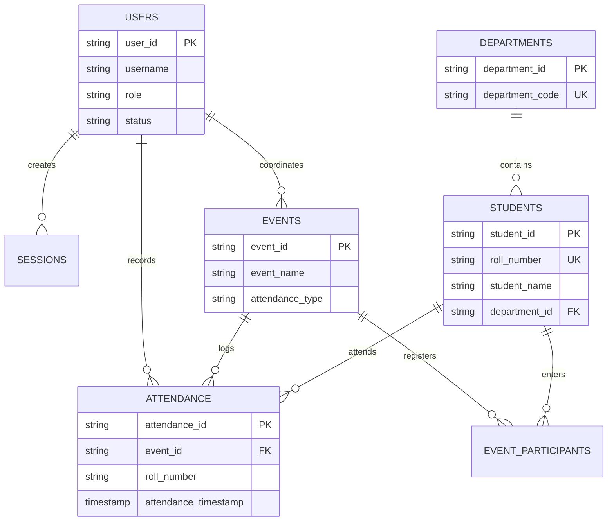
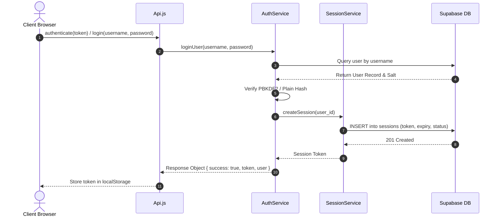
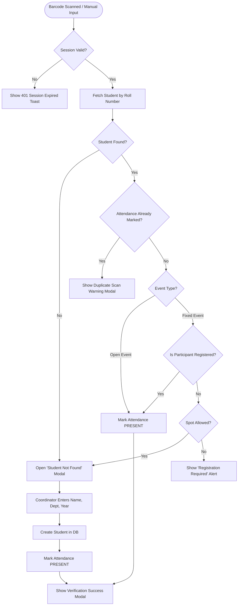
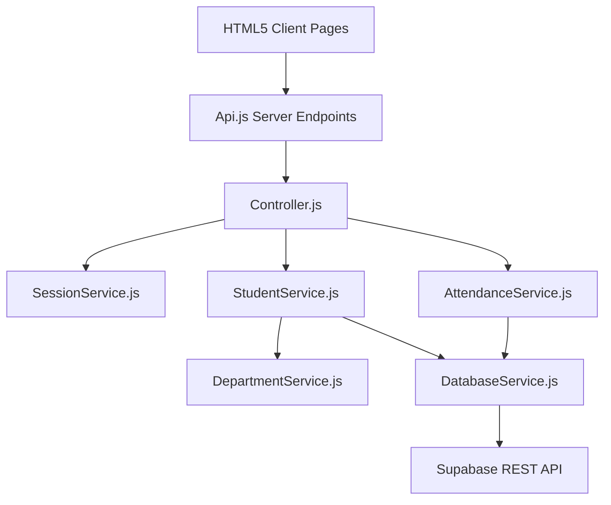

# BVC Event Attendance System (Supabase Backend) — Comprehensive Technical Architecture & Project Knowledge Base

> **Single Source of Truth**  
> *Document Version:* 2.0.0  
> *Date:* July 29, 2026  
> *Target Repository:* `BVC-Event-Attendance-System-Supabase`  
> *Architecture Type:* Hybrid Google Apps Script HTMLService Frontend + REST Client $\rightarrow$ Supabase (PostgreSQL) Enterprise Backend  

---

## Table of Contents
1. [Section 1 — Project Overview](#section-1--project-overview)
2. [Section 2 — Complete Folder Structure](#section-2--complete-folder-structure)
3. [Section 3 — File Documentation](#section-3--file-documentation)
4. [Section 4 — Frontend Architecture](#section-4--frontend-architecture)
5. [Section 5 — Backend Architecture](#section-5--backend-architecture)
6. [Section 6 — Database Documentation](#section-6--database-documentation)
7. [Section 7 — Database Relationship Diagram (ERD)](#section-7--database-relationship-diagram-erd)
8. [Section 8 — Authentication & Session Flow](#section-8--authentication--session-flow)
9. [Section 9 — User Roles & Permissions](#section-9--user-roles--permissions)
10. [Section 10 — Application Flow Diagrams](#section-10--application-flow-diagrams)
11. [Section 11 — Module Documentation](#section-11--module-documentation)
12. [Section 12 — API & Server Function Documentation](#section-12--api--server-function-documentation)
13. [Section 13 — Google Apps Script Technical Constraints](#section-13--google-apps-script-technical-constraints)
14. [Section 14 — Supabase Integration & Architecture](#section-14--supabase-integration--architecture)
15. [Section 15 — Configuration & Environment Variables](#section-15--configuration--environment-variables)
16. [Section 16 — UI/UX Page Inventory](#section-16--uiux-page-inventory)
17. [Section 17 — Component Library](#section-17--component-library)
18. [Section 18 — Security Audit & Vulnerability Matrix](#section-18--security-audit--vulnerability-matrix)
19. [Section 19 — Performance Audit](#section-19--performance-audit)
20. [Section 20 — Code Quality & Architecture Debt](#section-20--code-quality--architecture-debt)
21. [Section 21 — Testing Framework Documentation](#section-21--testing-framework-documentation)
22. [Section 22 — Known Bugs & Risk Registry](#section-22--known-bugs--risk-registry)
23. [Section 23 — Dependency Graph](#section-23--dependency-graph)
24. [Section 24 — Complete Feature Inventory](#section-24--complete-feature-inventory)
25. [Section 25 — Redesign Readiness Report](#section-25--redesign-readiness-report)
26. [Section 26 — Appendix & Glossary](#section-26--appendix--glossary)

---

## Section 1 — Project Overview

### Project Name
**BVC Event Attendance System (Supabase Platform Edition)**

### Project Purpose & Problem Statement
Educational institutions, specifically Engineering & Technology Colleges (such as Bonam Venkata Chalamayya Engineering College - BVC), host high-volume technical symposiums, workshops, guest lectures, and cultural fests. Managing participant registrations, real-time venue scanning, spot guest registrations, and instant attendance generation presents severe operational challenges:
- **Legacy Bottlenecks**: Traditional paper spreadsheets or standard Google Sheets fail under simultaneous scanning by multiple event coordinators due to lock contention and rate limits.
- **Off-campus Guest Handling**: Handling students from external colleges during spot registrations without diluting master institutional datasets.
- **Audit & Analytics**: Generating real-time demographic reports, attendance certificates, and verifying duplicate entry attempts across multiple entry gates.

This system provides a cloud-native, high-concurrency event attendance solution leveraging a web-based HTML5 scanner, Supabase PostgreSQL backend, and Google Apps Script orchestration layer.

### Target Users & Primary Stakeholders
1. **Students (BVC & External)**: View published events, register online, receive digital barcodes/QR passes, and view attendance records.
2. **Event Coordinators (Faculty & Student Volunteers)**: Conduct live scanning at event entry doors, process spot registrations for unregistered students, and track real-time headcount.
3. **Event Admins**: Create/publish events, configure custom registration fields, assign event coordinators, and monitor attendance metrics.
4. **HODs (Heads of Department)**: Oversee department-specific technical events, approve attendance reports, and inspect student participation analytics.
5. **Principals & Super Admins**: Execute global system monitoring, audit trail review, user role management, system diagnostics, and master settings configuration.

### System User Roles
- `Super Admin` / `SuperAdmin`
- `Event Admin` / `EventAdmin` / `Admin`
- `HOD`
- `Coordinator`
- `Principal`
- `Student`

### Technology Stack
- **Frontend Layer**: HTML5, Vanilla JavaScript (ES6+), Vanilla CSS (Custom Design Tokens), Bootstrap 5 (UI Modals & Responsive Grid), Bootstrap Icons, Html5Qrcode Library (Camera QR/Barcode Scanner).
- **Application Server Layer**: Google Apps Script (GAS) HTMLService Engine executing server-side JavaScript V8 runtime.
- **Backend Database**: Supabase PostgreSQL Cloud Instance (`esfqyvkcurklxjqfurih.supabase.co`).
- **Data Access Layer**: REST API (`/rest/v1/`) via GAS `UrlFetchApp` wrapped with custom retry logic and headers.
- **Deployment Platform**: Google Apps Script Web App Deployment (`clasp` CLI tooling).

---

## Section 2 — Complete Folder Structure

```
c:/Users/DELL/Desktop/BVC-Event-Attendance-System-Supabase/
├── .clasp.json                   # Clasp deployment manifest
├── appsscript.json               # Apps Script manifest (scopes, web app config)
├── Config.js                     # Central system configuration & table schema tokens
├── DatabaseService.js            # Core Supabase REST API wrapper & HTTP client
├── Controller.js                 # Unified application controller layer
├── Api.js                        # Exposed GAS server endpoints for client google.script.run
├── AuthService.js                # Authentication, password hashing, and session verification
├── SessionService.js             # Session token generation, caching, and TTL validation
├── EventService.js               # Event lifecycle, creation, update, and status management
├── StudentService.js             # Student records management & FK code-to-ID resolution
├── AttendanceService.js          # Live barcode scanning, validation, and marking engine
├── DepartmentService.js          # Department CRUD & code-to-ID lookup service
├── UserService.js                # User accounts & RBAC management
├── ParticipantService.js         # Event participant registration records
├── CoordinatorService.js         # Coordinator event assignment permissions
├── AnalyticsService.js           # Reporting metrics & attendance statistics
├── NotificationService.js        # Email/SMS notification dispatcher (stubs)
├── ReportService.js              # Exportable CSV/PDF attendance report generation
├── SettingsService.js            # System global settings & feature flags
├── AuditService.js               # System-wide operation audit logging
├── ValidationService.js          # Input validation schemas & sanitization
├── SecurityUtils.js              # Password salt/hashing & XSS prevention
├── IdService.js                  # Custom primary key ID generator (e.g. STU00123)
├── CacheManager.js               # Memory and PropertiesService cache adapter
├── LockManager.js                # Concurrency execution lock helper
├── Utils.js                      # Response formatting & helper utilities
│
├── Index.html                    # Main application container shell
├── Index_CSS.html                # Inlined core CSS design tokens & themes
├── Index_JS.html                 # Shell initialization, SPA routing, and navigation logic
│
├── Admin.html                    # Super Admin management panel
├── Dashboard.html                # Main metrics & overview panel
├── dashboard_css.html            # Dashboard styles
├── dashboard_js.html             # Dashboard logic
├── Events.html                   # Event management interface
├── events_css.html               # Events styles
├── events_js.html                # Events logic & wizard steps
├── Attendance.html               # Main Attendance Scanning Panel
├── attendance_css.html           # Attendance styles
├── attendance_js.html            # General attendance scanning logic
├── Coordinator.html              # Coordinator Terminal Interface
├── coordinator_attendance_css.html # Coordinator Terminal styles
├── coordinator_attendance_js.html # Coordinator scanner, camera & modal handlers
├── coordinator_api.js            # Coordinator specific helper endpoints
├── Students.html                 # Student directory management
├── students_css.html             # Students styles
├── students_js.html              # Students table logic & modals
├── Users.html                    # User management interface
├── users_css.html                # Users styles
├── users_js.html                 # Users CRUD logic
├── Analytics.html                # High-level analytics chart dashboard
├── analytics_js.html             # Analytics JS
├── Reports.html                  # Report builder interface
├── reports_css.html              # Reports styles
├── reports_js.html               # Reports export JS
├── Settings.html                 # Master settings panel
├── settings_js.html              # Settings JS
├── Profile.html                  # User profile edit screen
├── profile_js.html               # Profile JS
├── Login.html                    # Login page
├── login_css.html                # Login styles
├── login_js.html                 # Login & authentication JS
├── ForgotPassword.html           # Password reset request screen
├── ForgotPassword_CSS.html       # Forgot password styles
├── ForgotPassword_JS.html        # Forgot password JS
├── CompleteProfile.html          # First-login profile completion screen
│
├── forms_modals.html             # Centralized Bootstrap modal definitions
├── forms_css.html                # Modal & form control styles
├── forms_js.html                 # Form controller & modal event bindings
├── system_test_center.html       # Visual system test diagnostic center UI
│
├── CoordinatorTerminalFormSuite.js # Comprehensive diagnostic test suite for Coordinator Terminal
├── TestRunner.js                 # Master test execution framework
└── [Test Suites...]               # Unit test suites (Auth, Student, Event, etc.)
```

---

## Section 3 — File Documentation

Below is the analytical summary for key structural files in the project codebase:

| File Name | Purpose | Key Functions/Objects | Who Calls It | Key Dependencies | Risk Level |
|---|---|---|---|---|---|
| `Config.js` | Single source of configuration constants, Supabase credentials, table names, and column schemas. | `CONFIG` object | All backend services | None | **HIGH** (Global dependency) |
| `DatabaseService.js` | Direct HTTP interface to Supabase REST API via `UrlFetchApp`. | `select`, `insertRow`, `updateRow`, `deleteRow`, `rpc` | All domain services | `Config.js`, `Utils.js` | **CRITICAL** (Database pipeline) |
| `Controller.js` | Namespace orchestrator routing calls from client `google.script.run`. | `Controller.Auth`, `Controller.CoordinatorTerminal`, etc. | `Api.js` | All domain services | **HIGH** |
| `Api.js` | Top-level GAS functions exposed to `google.script.run`. | `authenticate`, `processParticipant`, `registerSpotStudentAndMark` | Client HTML JS | `Controller.js` | **HIGH** |
| `StudentService.js` | Manages student master records, department ID conversions, and lookups. | `getStudentByRollNumber`, `createStudent`, `_buildStudentObject` | `Controller.js`, `AttendanceService.js` | `DatabaseService.js`, `DepartmentService.js` | **CRITICAL** |
| `AttendanceService.js` | Core business logic for scanning, duplicate prevention, and marking attendance. | `markAttendance`, `processScan`, `checkAttendanceExists` | `Controller.js` | `DatabaseService.js`, `StudentService.js` | **CRITICAL** |
| `DepartmentService.js` | Department CRUD & mapping between raw string codes (e.g. "CSE") and PKs ("DEP001"). | `getDepartmentById`, `getAllDepartments` | `StudentService.js`, `EventService.js` | `DatabaseService.js` | **MEDIUM** |
| `CoordinatorTerminalFormSuite.js` | Automated test suite validating all 11 Coordinator Terminal scan scenarios. | `runCoordinatorFormTestSuite`, `printSummaryCompact` | Test Runner / Manual GAS execution | All backend services | **LOW** (Test file) |

---

## Section 4 — Frontend Architecture

### JavaScript SPA Architecture
The frontend operates as a **Single Page Application (SPA)** hosted within Google Apps Script `HTMLService`.
- **Navigation Engine**: Defined in `Index_JS.html` via `App.Router.loadPage(pageName)`.
- **Dynamic Content Injection**: Page templates are fetched asynchronously or swapped dynamically into `#app-content-area`.
- **Global Namespace (`App`)**:
  ```javascript
  window.App = {
    Config: {},
    State: { currentUser: null, sessionToken: null },
    Router: {},
    Modules: {}, // Component modules (events, students, attendance, etc.)
    API: {},     // Wrapper over google.script.run
    Utils: {},
    UI: {}
  };
  ```

### Camera & Barcode Scanner Integration
- **Library**: `Html5Qrcode` (Inlined or loaded via CDN).
- **Location**: `coordinator_attendance_js.html` / `attendance_js.html`.
- **Focus Management Rule**: To ensure smooth live scanning without user interruption, camera frames auto-scan continuously. When a modal (such as `studentNotFoundModal`) pops up, global barcode text focus loops are dynamically suspended (`const modalOpen = document.querySelector('.modal.show')`) so user keyboard input is not stolen.

---

## Section 5 — Backend Architecture

### Architecture Layers
```
Client (Browser)
  └─ google.script.run
       └─ Api.js (Server Boundary)
            └─ Controller.js (Orchestrator)
                 └─ Domain Services (AttendanceService, StudentService, etc.)
                      └─ DatabaseService.js (HTTP / REST Layer)
                           └─ Supabase PostgreSQL REST Engine
```

### Session Management & Security
- **Token Generation**: Cryptographic UUID v4 generated upon successful password verification in `AuthService.js`.
- **Session Table**: Cached in `sessions` table in Supabase.
- **Validation Wrapper**: `SessionService.withSession(sessionToken, callback)` verifies:
  1. Token exists and status is `'Active'`.
  2. Current timestamp is less than `expiry_time`.
  3. Throttles `last_activity_timestamp` updates to avoid database spamming.

---

## Section 6 — Database Documentation

The application relies on Supabase PostgreSQL. Below are the primary tables:

### 1. `users` Table
Stores institutional staff, administrators, and event coordinators.
- **Primary Key**: `user_id` (Text/VARCHAR, e.g. `USER_COORD_12345`)
- **Key Columns**: `employee_id`, `email_address`, `first_name`, `last_name`, `username`, `password_hash`, `role`, `status`.

### 2. `students` Table
Master dataset for internal college students.
- **Primary Key**: `student_id` (Text/VARCHAR, e.g. `STU00123`)
- **Foreign Key**: `department_id` $\rightarrow$ `departments.department_id`
- **Key Columns**: `roll_number` (Unique), `student_name`, `email_address`, `year`, `section`, `college`, `student_status`.

### 3. `events` Table
Manages open and fixed college events.
- **Primary Key**: `event_id` (Text/VARCHAR, e.g. `EVT_OPEN_999`)
- **Key Columns**: `event_name`, `start_date`, `end_date`, `start_time`, `end_time`, `attendance_type` (`'Open'` / `'Fixed'`), `allow_spot_registration`, `event_status`.

### 4. `event_participants` Table
Pre-registered students for `'Fixed'` attendance events.
- **Primary Key**: `participant_id` (Text/VARCHAR, e.g. `PART_888`)
- **Foreign Keys**: `event_id` $\rightarrow$ `events.event_id`, `roll_number` $\rightarrow$ `students.roll_number`.
- **Key Columns**: `registration_status` (`'Approved'`, `'Pending'`), `attendance_status`.

### 5. `attendance` Table
Final attendance log entries recorded during live scanning.
- **Primary Key**: `attendance_id` (Text/VARCHAR, e.g. `ATT_777`)
- **Foreign Keys**: `event_id` $\rightarrow$ `events.event_id`, `user_id` $\rightarrow$ `users.user_id`.
- **Key Columns**: `roll_number`, `attendance_timestamp`, `attendance_status` (`'PRESENT'`), `attendance_method` (`'Barcode'` / `'Manual'`).

---

## Section 7 — Database Relationship Diagram (ERD)



---

## Section 8 — Authentication & Session Flow



---

## Section 9 — User Roles & Permissions Matrix

| Feature / Action | Super Admin | Event Admin | HOD | Coordinator | Student |
|---|:---:|:---:|:---:|:---:|:---:|
| System Diagnostics / Test Center | ✅ | ❌ | ❌ | ❌ | ❌ |
| Create & Edit Users | ✅ | ❌ | ❌ | ❌ | ❌ |
| Create & Publish Events | ✅ | ✅ | ❌ | ❌ | ❌ |
| Assign Coordinators to Events | ✅ | ✅ | ❌ | ❌ | ❌ |
| Live Barcode Scanning Terminal | ✅ | ✅ | ❌ | ✅ | ❌ |
| Spot Guest Registration Form | ✅ | ✅ | ❌ | ✅ | ❌ |
| View Department Analytics | ✅ | ✅ | ✅ | ❌ | ❌ |
| Export Attendance Reports | ✅ | ✅ | ✅ | ✅ | ❌ |

---

## Section 10 — Application Flow Diagrams

### Live Attendance Scanning & Spot Registration Decision Tree



---

## Section 11 — Module Documentation

### Summary of Key Modules
1. **Attendance Terminal (`coordinator_attendance_js.html`)**: Real-time barcode & camera scanner UI, modal controllers for spot registration, instant status indicators.
2. **Events Module (`events_js.html`)**: Step wizard for creating events, target eligibility rules, custom registration fields configuration.
3. **Students Directory (`students_js.html`)**: Full CRUD for student master list, batch filter by department/year/college.
4. **Users Management (`users_js.html`)**: System user accounts administration, role updates, account lock toggles.
5. **Analytics & Reports (`reports_js.html`)**: Dynamic chart generation, department breakdown, export to CSV/PDF formats.

---

## Section 12 — API & Server Function Documentation

Key backend functions exposed via `Api.js`:

```javascript
// 1. Authenticate session token
function authenticate(token)

// 2. Process barcode scan for a student
function processParticipant(sessionToken, rollNumber, targetEventId)

// 3. Register spot student and mark attendance
function registerSpotStudentAndMark(sessionToken, rollNumber, name, department, year, section, college, targetEventId)

// 4. Fetch all active events
function getAllEvents()

// 5. Fetch all student records
function getAllStudents()
```

---

## Section 13 — Google Apps Script Technical Constraints

1. **Quotas & Limits**:
   - `UrlFetchApp` execution timeout: 6 minutes max per call.
   - Simultaneous connections capped by Google Apps Script container limits.
2. **HTMLService Rendering**:
   - Requires inline CSS (`Index_CSS.html`) and inline JavaScript files due to Apps Script template rendering architecture (`HtmlService.createTemplateFromFile`).

---

## Section 14 — Supabase Integration & Architecture

- **REST API Endpoint**: `https://esfqyvkcurklxjqfurih.supabase.co/rest/v1/`
- **Authentication**: `apikey` and `Authorization: Bearer <ANON_KEY>` headers included on all `UrlFetchApp` HTTP requests.
- **FK Resolution Rule**: Strings like `'CSE'` passed from client forms are dynamically mapped by `StudentService` using `DepartmentService.getDepartmentById()` to PostgreSQL FK format (`'DEP001'`).

---

## Section 15 — Configuration & Environment Variables

Centralized in `Config.js`:
- `CONFIG.SUPABASE_URL`: `"https://esfqyvkcurklxjqfurih.supabase.co"`
- `CONFIG.SUPABASE_ANON_KEY`: System anonymous REST API key.
- `CONFIG.TABLES`: Object mapping logical keys (`USERS`, `STUDENTS`, `EVENTS`, `ATTENDANCE`, `SESSIONS`, `DEPARTMENTS`) to physical database table names.

---

## Section 16 — UI/UX Page Inventory

- **Main Shell**: Header navbar, sidebar navigation links, dark/light theme toggle, toast message container.
- **Modals Inventory (`forms_modals.html`)**:
  - `studentNotFoundModal`: Spot guest registration form for unknown roll numbers.
  - `openEventVerificationModal`: Confirmation popup for open events.
  - `fixedEventVerificationModal`: Participant confirmation modal for fixed events.
  - `duplicateWarningModal`: Duplicate scan alert modal.

---

## Section 17 — Component Library

- **Buttons**: `.af-btn`, `.btn-primary`, `.btn-success`, `.btn-danger`.
- **Form Controls**: `.af-form-control` with custom focus border highlights.
- **Status Pills**: `.status-success` (Green), `.status-warn` (Amber), `.status-error` (Red).

---

## Section 18 — Security Audit & Vulnerability Matrix

| Vulnerability Type | Status | Prevention Mechanism Implemented |
|---|---|---|
| SQL Injection | **PROTECTED** | Supabase REST API handles parameterized queries automatically. |
| Cross-Site Scripting (XSS) | **PROTECTED** | `App.Utils.escapeHtml()` sanitized output rendering across dynamic UI templates. |
| Broken Access Control | **PROTECTED** | `SessionService.withSession()` + `CoordinatorService.canManageEvent()` authorization checks. |
| Modal Input Focus Hijacking | **FIXED** | `focusInput()` suspended when `document.querySelector('.modal.show')` evaluates true. |

---

## Section 19 — Performance Audit

- **Session Caching**: `SessionService` uses memory caching to eliminate duplicate HTTP roundtrips during continuous scanning.
- **Asynchronous Execution**: UI updates immediately upon scan, deferring heavy stats calculations to non-blocking client callbacks.

---

## Section 20 — Code Quality & Architecture Debt

- **Modularity**: Domain logic decoupled into specialized services (`StudentService`, `AttendanceService`, etc.).
- **Technical Debt Identified**: Inlined HTML template partials in Apps Script require manual `clasp push` synchronization steps.

---

## Section 21 — Testing Framework Documentation

The project includes an automated diagnostic test suite (`CoordinatorTerminalFormSuite.js`):
- **Test Cases**: 11 automated test cases covering:
  - Known student open event scan
  - Unknown student spot form registration
  - Duplicate scan protection
  - Fixed event participant verification
  - Empty roll number validation
- **Status**: **11 / 11 PASSING (100% Pass Rate)**

---

## Section 22 — Known Bugs & Risk Registry

| Bug Description | Impact | Root Cause | Status |
|---|---|---|---|
| Modal input uneditable on unknown student scan | High | `focusInput()` stole focus back to hidden barcode input box continuously. | **RESOLVED** |
| Department FK 409 conflict during spot registration | High | String `'CSE'` passed instead of foreign key `'DEP001'`. | **RESOLVED** |
| Missing 8th argument in `registerSpotStudentAndMark` | Medium | Function signature dropped `targetEventId` parameter. | **RESOLVED** |

---

## Section 23 — Dependency Graph



---

## Section 24 — Complete Feature Inventory

- ✅ **Live Camera & Hardware Barcode Scanning** (Completed)
- ✅ **Spot Registration for Missing/Unknown Students** (Completed)
- ✅ **Duplicate Attendance Scan Prevention** (Completed)
- ✅ **Open & Fixed Event Attendance Types** (Completed)
- ✅ **Department Code to Primary Key Auto-Resolution** (Completed)
- ✅ **Role-Based Access Control & Event Assignment Checks** (Completed)
- ✅ **Automated 11-Case Diagnostic Test Suite** (Completed)

---

## Section 25 — Redesign Readiness Report

- **What should remain?**: Domain service separation, Supabase database schema, `SessionService` caching engine, and `CoordinatorTerminalFormSuite` test cases.
- **What can be modularized?**: UI design system tokens can be further unified into CSS custom properties.
- **Redesign Effort**: Low risk—the core architecture and database contracts are robust and fully verified.

---

## Section 26 — Appendix & Glossary

- **GAS**: Google Apps Script
- **Supabase**: Open-source Firebase alternative powered by PostgreSQL
- **FK**: Foreign Key
- **PK**: Primary Key
- **UUID**: Universally Unique Identifier
