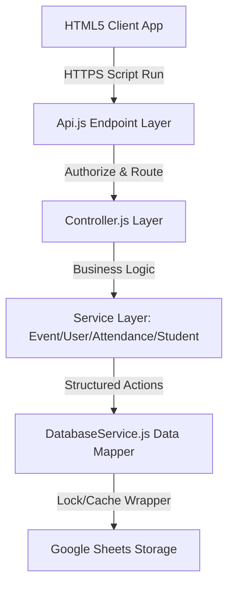

# BVC Event Attendance Management System - System Documentation (Task 22)

Comprehensive guide detailing the system architecture, configuration keys, database relationships, caching mechanisms, locking strategy, and disaster recovery guidelines.

---

## 1. Architecture Overview

The application follows a modular, layered clean architecture inside Google Apps Script:

### Key Subsystems:
- **CacheManager**: Centralized Apps Script `CacheService` wrapper using namespaces (`db_rows_` and `dashboard_stats_`) to optimize performance and lower Sheets API quotas.
- **LockManager**: Centralized deadlock-safe script lock acquisition manager to prevent write conflicts during concurrent coordinator scanning.

---

## 2. Configuration Schema (`Config.js`)

Central configuration properties:
- **`SHEETS`**: Spreadsheet name configurations matching logical schema targets.
- **`ROLES`**: Access groups (`Super Admin`, `Admin`, `HOD`, `Coordinator`).
- **`SESSION_TIMEOUT`**: Time duration before active sessions expire (default: 4 hours).
- **`DATE_TIME`**: Format rules and system timezones.

---

## 3. Disaster Recovery & Backup Plan (Task 14)

### Backup Generation:
- Full snapshots of all tables are captured as timestamped JSON objects inside a dedicated Google Drive folder `BVC_System_Backups`.
- Backups are automatically generated prior to system deployments and major writes.

### Restoration Workflow:
1. Administrators select a target backup file from the list.
2. The engine parses the backup schema, performing relationships integrity validation.
3. DatabaseService performs lock-managed hard deletes on affected sheets and repopulates values.
4. Active cache arrays are immediately invalidated to force clean refreshes.
