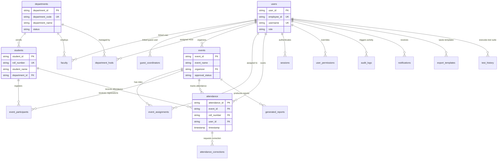

# Entity-Relationship (ER) Diagram — BVC Event Attendance System

The following diagram illustrates the key entities and relationships across the database schema:

```mermaid
erDiagram
    departments ||--o{ students : "enrolls"
    departments ||--o{ faculty : "employs"
    departments ||--o{ department_hods : "managed by"

    users ||--o{ faculty : "linked user"
    users ||--o{ guest_coordinators : "linked guest user"
    users ||--o{ department_hods : "assigned HOD"
    users ||--o{ events : "organizes"
    users ||--o{ event_assignments : "assigned to"
    users ||--o{ attendance : "scans"
    users ||--o{ sessions : "authenticates"
    users ||--o{ user_permissions : "overrides"

    students ||--o{ event_participants : "registers"
    students ||--o{ attendance : "records attendance"

    events ||--o{ event_assignments : "has roles"
    events ||--o{ event_participants : "receives registrations"
    events ||--o{ attendance : "tracks attendance"
    events ||--o{ generated_reports : "produces reports"

    attendance ||--o{ attendance_corrections : "requests correction"

    users ||--o{ audit_logs : "triggers activity"
    users ||--o{ notifications : "receives"
    users ||--o{ export_templates : "saves templates"
    users ||--o{ test_history : "executes test suite"

    departments {
        string department_id PK
        string department_code UK
        string department_name
        string status
    }

    students {
        string student_id PK
        string roll_number UK
        string student_name
        string department_id FK
    }

    users {
        string user_id PK
        string employee_id UK
        string username UK
        string role
    }

    events {
        string event_id PK
        string event_name
        string organizer FK
        string approval_status
    }

    attendance {
        string attendance_id PK
        string event_id FK
        string roll_number FK
        string user_id FK
        timestamp timestamp
    }
```
