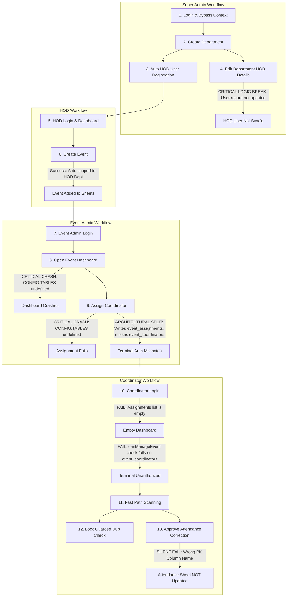

# BVC Event Attendance System: Production Readiness Audit Report

This report compiles the exhaustive end-to-end architectural, functional, security, and process logic audit for the BVC Event Attendance System. It evaluates whether the system's execution chains are robust enough for production deployment.

---

## 1. Executive Summary of Audit
* **Audit Mode**: Read-Only (no code mutations performed during this execution phase).
* **Overall Status**: **NOT READY FOR PRODUCTION**.
* **Major Findings**:
  - **Script Runtime Crashing Blockers**: The Event Admin Dashboard and Analytics view are broken due to undefined `CONFIG.TABLES` references and a non-existent `DatabaseService.selectAll()` method.
  - **Dead API Endpoints**: Multiple controller methods in `Controller.Student` target non-existent functions in `StudentService.js` (`getStudentsByDepartment`, `getStudentsByYear`, `getStudentsBySection`, `searchStudents`), leading to backend crashes if invoked.
  - **Authentication / Authorization Logic Gaps**: 
    - The client-side permission check `App.Session.hasPermission` falls back to `return true` for the `COORDINATOR` role, allowing coordinators UI access to admin modules.
    - HOD updates in `DepartmentService.updateDepartment` do not sync or create new HOD accounts on the users table.
  - **Data Integrity / Sync Issues**: 
    - Attendance corrections are updated on the requests table, but the update on the `attendance` sheet fails silently because it references the wrong column name (`attendance_id` instead of `Attendance ID`).
    - Coordinator assignments are split across two duplicate tables (`event_assignments` vs `event_coordinators`) that use different formats and are not in sync, preventing coordinators from accessing the scanner terminal.

---

## 2. End-to-End Workflow Trace & Break Analysis

---

## 3. Discovered Issues Roster (Categorized by Severity)

### 🔴 Critical Severity Issues (Blockers)

#### 1. TypeError: Undefined CONFIG.TABLES references in EventAdminService and AnalyticsService
* **File Name**: [EventAdminService.js](file:///c:/Users/DELL/Desktop/BVC-Event-Attendance-System-Supabase/EventAdminService.js) (lines 38, 45, 56, 63, 138, 159, 167, 189, 193, 231, 242) and [AnalyticsService.js](file:///c:/Users/DELL/Desktop/BVC-Event-Attendance-System-Supabase/AnalyticsService.js) (lines 114, 115)
* **Function**: `EventAdminService.getEventAdminDashboard`, `EventAdminService.assignCoordinator`, `EventAdminService.removeAssignment`, `AnalyticsService.getSingleEventAnalytics`
* **Reproduction Steps**:
  1. Log in as an Event Admin user.
  2. Select an event from the Event Context dropdown.
  3. The event dashboard page loads but fails to populate statistics and coordinators, displaying a blank screen with error logs.
* **Expected Behaviour**: Read/Write actions correctly fetch sheet names from configuration mappings and query Google Sheets rows.
* **Actual Behaviour**: Script runtime crashes immediately with: `TypeError: Cannot read properties of undefined (reading 'EVENTS')`.
* **Root Cause**: The service references `CONFIG.TABLES` which is not defined in `Config.js` (where sheet names are defined under `CONFIG.SHEETS`).
* **Workflow Impact**: Blocks Event Admins from performing any operations (dashboard statistics loading, assigning coordinators, and viewing analytics).

#### 2. TypeError: DatabaseService.selectAll is not a function
* **File Name**: [AnalyticsService.js](file:///c:/Users/DELL/Desktop/BVC-Event-Attendance-System-Supabase/AnalyticsService.js) (line 115)
* **Function**: `AnalyticsService.getSingleEventAnalytics`
* **Reproduction Steps**:
  1. Log in as HOD or Event Admin.
  2. Go to the Single Event Analytics tab.
  3. The page fails to load and logs a backend exception.
* **Expected Behaviour**: The analytics manager loads student demographics and builds reports.
* **Actual Behaviour**: Backend crashes with: `TypeError: DatabaseService.selectAll is not a function`.
* **Root Cause**: `DatabaseService.js` implements `readAllRows` but does not expose a `selectAll` method.
* **Workflow Impact**: Prevents compilation of year-wise, department-wise, and college-wise attendee charts.

#### 3. TypeError: Dead Student Controller APIs calling Non-Existent Methods
* **File Name**: [Controller.js](file:///c:/Users/DELL/Desktop/BVC-Event-Attendance-System-Supabase/Controller.js) (lines 558-596)
* **Function**: `Controller.Student.searchStudents`, `Controller.Student.getStudentsByDepartment`, `Controller.Student.getStudentsByYear`, `Controller.Student.getStudentsBySection`
* **Reproduction Steps**:
  1. Trigger client-side direct AJAX calls targeting `searchStudents`, `getStudentsByDepartment`, `getStudentsByYear`, or `getStudentsBySection`.
* **Expected Behaviour**: Backend queries student databases and returns matching student records arrays.
* **Actual Behaviour**: Crashes immediately on execution: `TypeError: StudentService.searchStudents is not a function`.
* **Root Cause**: The endpoints are exposed in `Controller.js` but the corresponding functions are not defined in `StudentService.js`.
* **Workflow Impact**: Dead routes that crash on execution if called by custom client integrations.

---

### 🟡 High Severity Issues

#### 1. Split-Brain Coordinator Assignment Schema Mismatch
* **File Name**: [EventAdminService.js](file:///c:/Users/DELL/Desktop/BVC-Event-Attendance-System-Supabase/EventAdminService.js) (line 189) and [CoordinatorService.js](file:///c:/Users/DELL/Desktop/BVC-Event-Attendance-System-Supabase/CoordinatorService.js) (line 540)
* **Function**: `EventAdminService.assignCoordinator` and `CoordinatorService.canManageEvent`
* **Reproduction Steps**:
  1. Assign a coordinator to an event using the Event Admin panel.
  2. The coordinator attempts to log in and open the scan terminal.
* **Expected Behaviour**: Coordinator is authorized and gets access to the event scanner.
* **Actual Behaviour**: Coordinator terminal opens to a blank screen or throws "Unauthorized: You are not assigned to manage this event".
* **Root Cause**: `EventAdminService.js` only writes to the `event_assignments` sheet, while `CoordinatorService.canManageEvent` verifies the assignment against the `event_coordinators` sheet. These two lists use different keys and are out of sync.
* **Workflow Impact**: Renders coordinator assignments made by Event Admins completely useless, locking coordinators out of the system.

#### 2. Logical Sync Failure: HOD User Sync Missing on Department Update
* **File Name**: [DepartmentService.js](file:///c:/Users/DELL/Desktop/BVC-Event-Attendance-System-Supabase/DepartmentService.js) (lines 599-725)
* **Function**: `DepartmentService.updateDepartment`
* **Reproduction Steps**:
  1. Log in as Super Admin.
  2. Navigate to Settings -> Departments -> Edit Department.
  3. Change the assigned HOD details and click Save.
* **Expected Behaviour**: The new HOD user account is automatically registered in the `users` table, and credentials are sent to their email.
* **Actual Behaviour**: The department record is updated on the `departments` sheet, but no HOD user account changes occur.
* **Root Cause**: `updateDepartment` lacks the HOD user registration and reactivation logic implemented in `createDepartment`.
* **Workflow Impact**: Super Admins cannot assign a new HOD to a department via the UI edit flow, leaving the new HOD unable to log in.

#### 3. Client-Side Authorization Bypass for Coordinator Role
* **File Name**: [common_js.html](file:///c:/Users/DELL/Desktop/BVC-Event-Attendance-System-Supabase/common_js.html) (lines 253-276)
* **Function**: `App.Session.hasPermission`
* **Reproduction Steps**:
  1. Log in as a Coordinator.
  2. Bypassing UI elements, try to access `/users` or `/settings` pages.
* **Expected Behaviour**: Permission engine returns `false` for unauthorized modules.
* **Actual Behaviour**: Returns `true` for all pages.
* **Root Cause**: The function has no explicit checking block for the `COORDINATOR` role and falls through to the default `return true`.
* **Workflow Impact**: Sub-admin pages are exposed client-side to coordinator-level accounts.

#### 4. Silent Failure: Attendance Correction approval does not update Attendance Sheet
* **File Name**: [AttendanceCorrectionService.js](file:///c:/Users/DELL/Desktop/BVC-Event-Attendance-System-Supabase/AttendanceCorrectionService.js) (line 87)
* **Function**: `AttendanceCorrectionService.approveRequest`
* **Reproduction Steps**:
  1. Submit an attendance correction request.
  2. Log in as HOD and click "Approve" on the request.
* **Expected Behaviour**: The requests database status changes to "Approved", and the target student's row in the `attendance` sheet is updated.
* **Actual Behaviour**: The correction request changes to "Approved", but the student's attendance row remains unmodified.
* **Root Cause**: The code attempts to match row updates on `'attendance_id'`, but the actual column header in the Google Sheet is `"Attendance ID"` (Title Case).
* **Workflow Impact**: Silently fails to apply attendance corrections to the attendance sheet, causing data discrepancies between HOD reports and student attendance totals.

---

### 🟢 Medium & Low Severity Issues

#### 1. Coordinator Data Export Filter Mismatch
* **File Name**: [ExportService.js](file:///c:/Users/DELL/Desktop/BVC-Event-Attendance-System-Supabase/ExportService.js) (lines 155-160)
* **Function**: `ExportService.processCustomExport`
* **Reproduction Steps**:
  1. Log in as Coordinator and click "Export Details".
* **Expected Behaviour**: Custom export includes event scans assigned to that coordinator.
* **Actual Behaviour**: Returns an empty data sheet.
* **Root Cause**: The code references `c.user_id` on records from the `event_coordinators` sheet, but the sheet column key is actually `'User ID'` (Title Case).
* **Workflow Impact**: Coordinators cannot use custom exports.

---

## 4. Prioritized List of Action Items
1. **Critical**: Replace `CONFIG.TABLES` with `CONFIG.SHEETS` across `EventAdminService.js` and `AnalyticsService.js`.
2. **Critical**: Replace `DatabaseService.selectAll` with `DatabaseService.readAllRows` in `AnalyticsService.js`.
3. **Critical**: Unify coordinator assignment sheets. Let `EventAdminService.js` write to `CONFIG.SHEETS.EVENT_COORDINATORS` and align the column keys to Title Case matching the sheet schema, or configure a single standard assignments table.
4. **High**: Update `App.Session.hasPermission` in `common_js.html` to explicitly handle `COORDINATOR` and restrict access to unauthorized pages.
5. **High**: Correct column key references in `AttendanceCorrectionService.js` and `ExportService.js` from snake_case to Title Case (e.g., `'Attendance ID'`, `'User ID'`) to match the Google Sheet schemas.
6. **High**: Integrate HOD user creation/activation sync logic into `DepartmentService.updateDepartment`.
